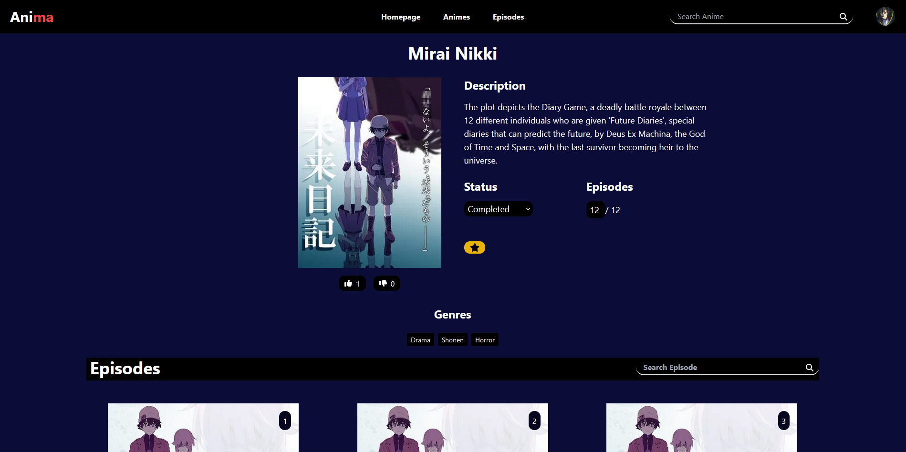
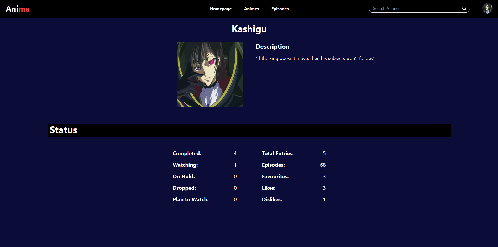

# Anima

Anima is a Single Page Application that allows users to view and search for anime. 
The application supports multiple user types, including standard users and administrators, each with different permissions.

## Stacks Used
- Next.js / React
- TypeScript

## Libraries Used
- TailwindCSS
- React Hot Toast (Real-time Notifications)

## Screenshots

 

 

 

 

 

 

## Important Notice

This project is intended for educational purposes only. It is a demonstration of my full-stack development skills and is not designed for production use. Any attempts to deploy this application in a live environment, particularly as a streaming service, may violate copyright laws and other regulations.
Please do not use this project for commercial or public streaming purposes. Thank you for your understanding!